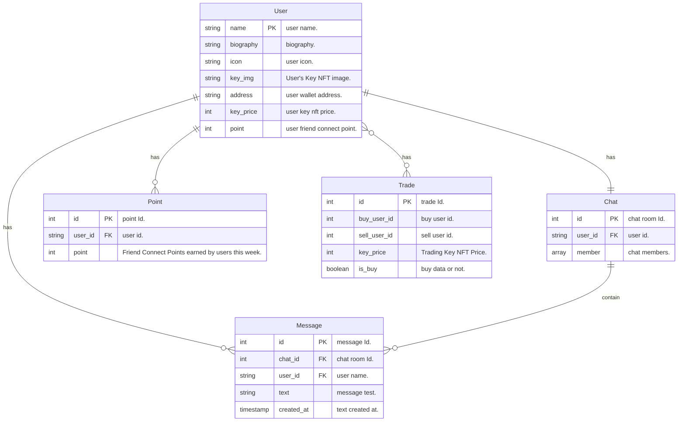

# ER Diagram

```mermaid
erDiagram
    User {
        string name PK "user name."
        string biography "biography."
        string icon "user icon."
        string key_img "User's Key NFT image."
        string address "user wallet address."
        int key_price "user key nft price."
        int point "user friend connect point."
    }
    Chat {
        int id PK "chat room Id."
        string user_id FK "user id."
        array member "chat members."

    }
    Message {
        int id PK "message Id."
        int chat_id FK "chat room Id."
        string user_id FK "user name."
        string text "message test."
        timestamp created_at "text created at."
    }
    Point {
        int id PK "point Id."
        string user_id FK "user id."
        int point "Friend Connect Points earned by users this week."
    }

    Trade {
        int id PK "trade Id."
        int buy_user_id "buy user id."
        int sell_user_id "sell user id."
        int key_price "Trading Key NFT Price."
        boolean is_buy "buy data or not."
    }

    User ||--o{ Point: has
    User ||--|| Chat: has
    User ||--o{ Message: has
    User }o--o{ Trade: has
    Chat ||--o{ Message: contain
```
