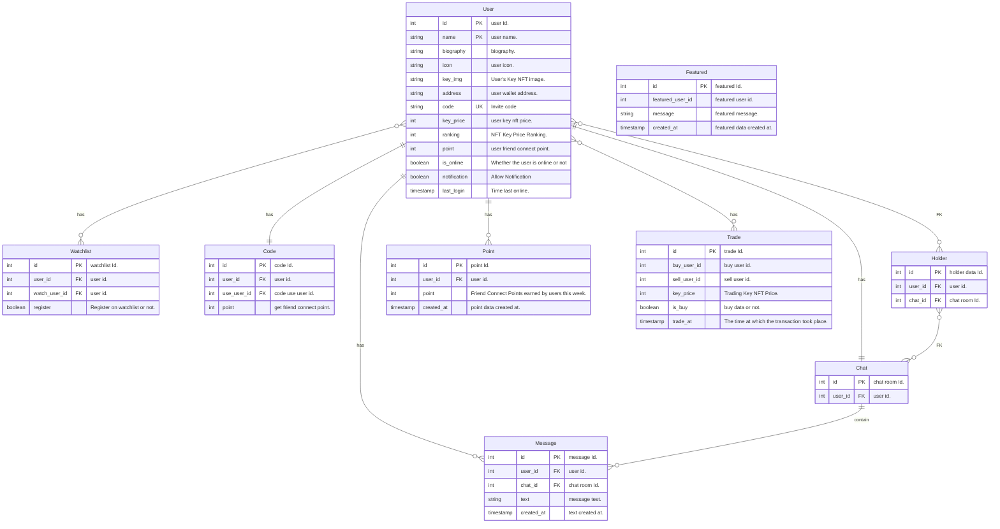

# ER Diagram

```mermaid
erDiagram
    User {
        int id PK "user Id."
        string name PK "user name."
        string biography "biography."
        string icon "user icon."
        string key_img "User's Key NFT image."
        string address "user wallet address."
        string code UK "Invite code"
        int key_price "user key nft price."
        int ranking "NFT Key Price Ranking."
        int point "user friend connect point."
        boolean is_online "Whether the user is online or not"
        boolean notification "Allow Notification"
        timestamp last_login "Time last online."
    }
    Watchlist {
        int id PK "watchlist Id."
        int user_id FK "user id."
        int watch_user_id FK "user id."
        boolean register "Register on watchlist or not."
    }
    Code {
        int id PK "code Id."
        int user_id FK "user id."
        int use_user_id FK "code use user id."
        int point "get friend connect point."
    }
    Chat {
        int id PK "chat room Id."
        int user_id FK "user id."
    }
    Message {
        int id PK "message Id."
        int user_id FK "user id."
        int chat_id FK "chat room Id."
        string text "message test."
        timestamp created_at "text created at."
    }
    Holder {
        int id PK "holder data Id."
        int user_id FK "user id."
        int chat_id FK "chat room Id."
    }
    Point {
        int id PK "point Id."
        int user_id FK "user id."
        int point "Friend Connect Points earned by users this week."
        timestamp created_at "point data created at."
    }
    Trade {
        int id PK "trade Id."
        int buy_user_id "buy user id."
        int sell_user_id "sell user id."
        int key_price "Trading Key NFT Price."
        boolean is_buy "buy data or not."
        timestamp trade_at "The time at which the transaction took place."
    }
    Featured {
        int id PK "featured Id."
        int featured_user_id "featured user id."
        string message "featured message."
        timestamp created_at "featured data created at."
    }
    User ||--o{ Point: has
    User ||--|| Code: has
    User ||--|| Chat: has
    User ||--o{ Message: has
    User }o--o{ Trade: has
    User }o--o{ Watchlist: has
    User }o--o{ Holder: FK
    Chat ||--o{ Message: contain
    Holder }o--o{ Chat: FK
```
