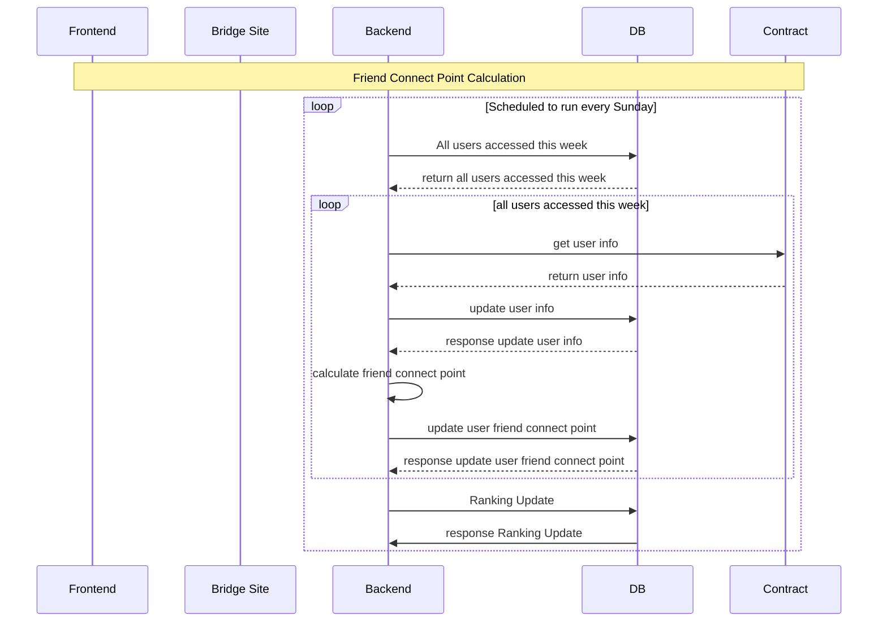

# Friend Connect Point

```mermaid
sequenceDiagram
    participant front as Frontend
    participant bridge as Bridge Site
    participant back as Backend
    participant db as DB
    participant contract as Contract

    Note over front,contract: Friend Connect Point Calculation
    loop Scheduled to run every Sunday
        back->>db: All users accessed this week
        db-->>back: return all users accessed this week
        loop all users accessed this week
            back->>contract: get user info
            contract-->>back: return user info
            back->>db: update user info
            db-->>back: response update user info
            back->>back: calculate friend connect point
            back->>db: update user friend connect point
            db-->>back: response update user friend connect point
        end
        back->>db: Ranking Update
        db->>back: response Ranking Update
    end
```
