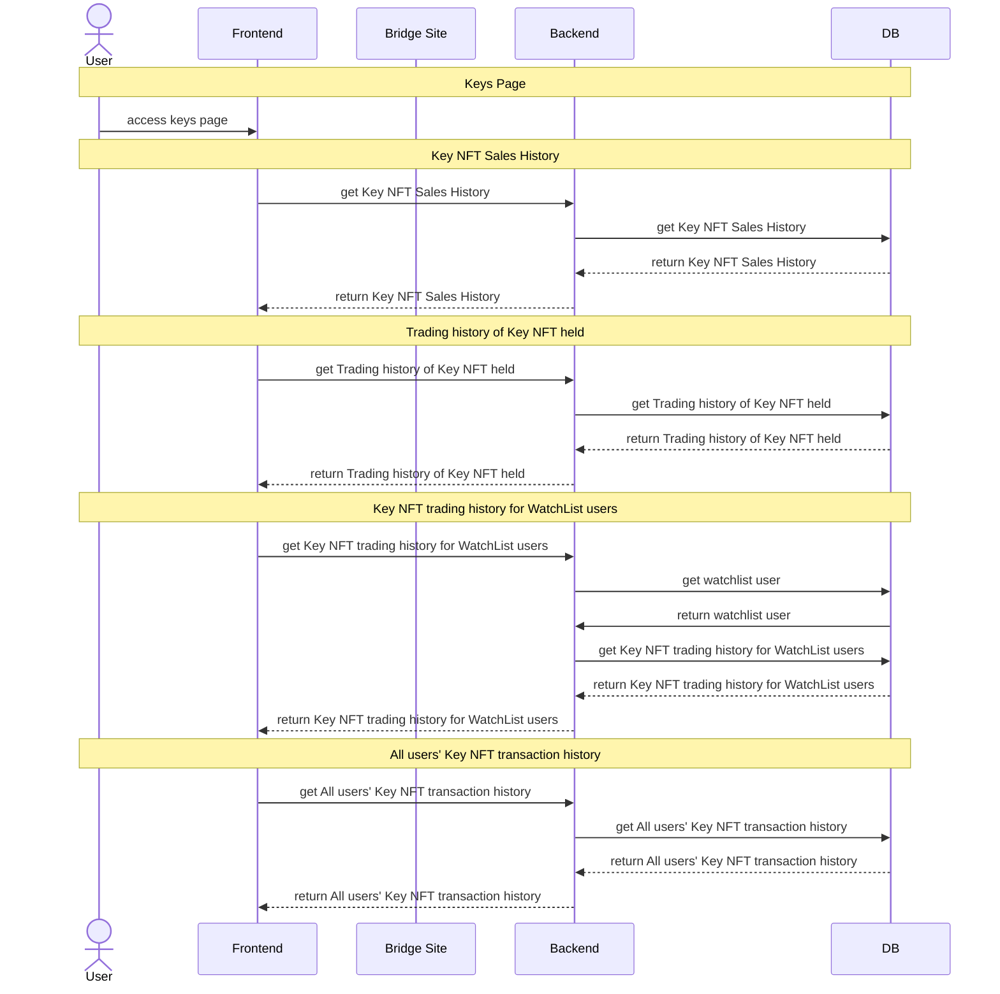

# Keys Page

```mermaid
sequenceDiagram
    actor user as User
    participant front as Frontend
    participant bridge as Bridge Site
    participant back as Backend
    participant db as DB

    Note over user,db: Keys Page
    user->>front: access keys page

    Note over user,db: Key NFT Sales History
    front->>back: get Key NFT Sales History
    back->>db: get Key NFT Sales History
    db-->>back: return Key NFT Sales History
    back-->>front: return Key NFT Sales History

    Note over user,db: Trading history of Key NFT held
    front->>back: get Trading history of Key NFT held
    back->>db: get Trading history of Key NFT held
    db-->>back: return Trading history of Key NFT held
    back-->>front: return Trading history of Key NFT held

    Note over user,db: Key NFT trading history for WatchList users
    front->>back: get Key NFT trading history for WatchList users
    back->>db: get watchlist user
    db->>back: return watchlist user
    back->>db: get Key NFT trading history for WatchList users
    db-->>back: return Key NFT trading history for WatchList users
    back-->>front: return Key NFT trading history for WatchList users

    Note over user,db: All users' Key NFT transaction history
    front->>back: get All users' Key NFT transaction history
    back->>db: get All users' Key NFT transaction history
    db-->>back: return All users' Key NFT transaction history
    back-->>front: return All users' Key NFT transaction history
```
