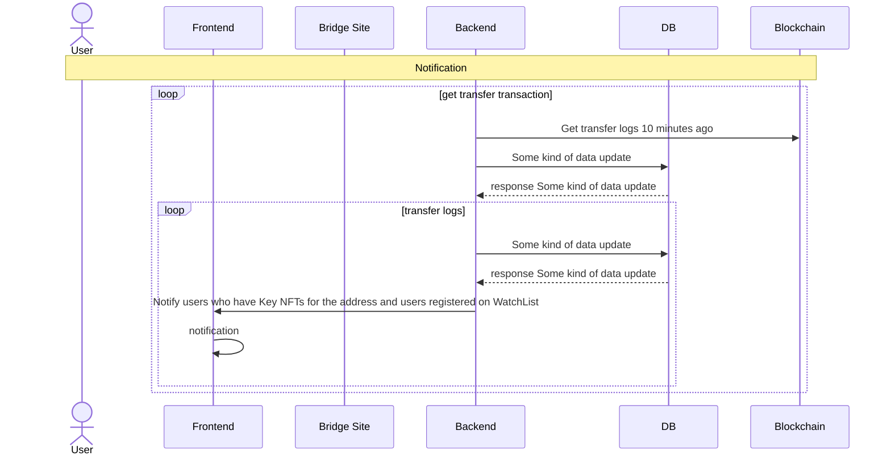

# Notification

```mermaid
sequenceDiagram
    actor user as User
    participant front as Frontend
    participant bridge as Bridge Site
    participant back as Backend
    participant db as DB
    participant blockchain as Blockchain

    Note over user,blockchain: Notification
    loop get transfer transaction
        back->>blockchain: Get transfer logs 10 minutes ago
        back->>db: Some kind of data update
            db-->>back: response Some kind of data update
        loop transfer logs
            back->>db: Some kind of data update
            db-->>back: response Some kind of data update
            back->>front: Notify users who have Key NFTs for the address and users registered on WatchList
            front->>front: notification
        end
    end
```
