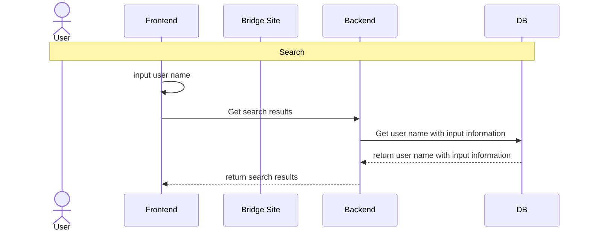

# Search

```mermaid
sequenceDiagram
    actor user as User
    participant front as Frontend
    participant bridge as Bridge Site
    participant back as Backend
    participant db as DB

    Note over user,db: Search
    front->>front: input user name
    front->>back: Get search results
    back->>db: Get user name with input information
    db-->>back: return user name with input information
    back-->>front: return search results
```
