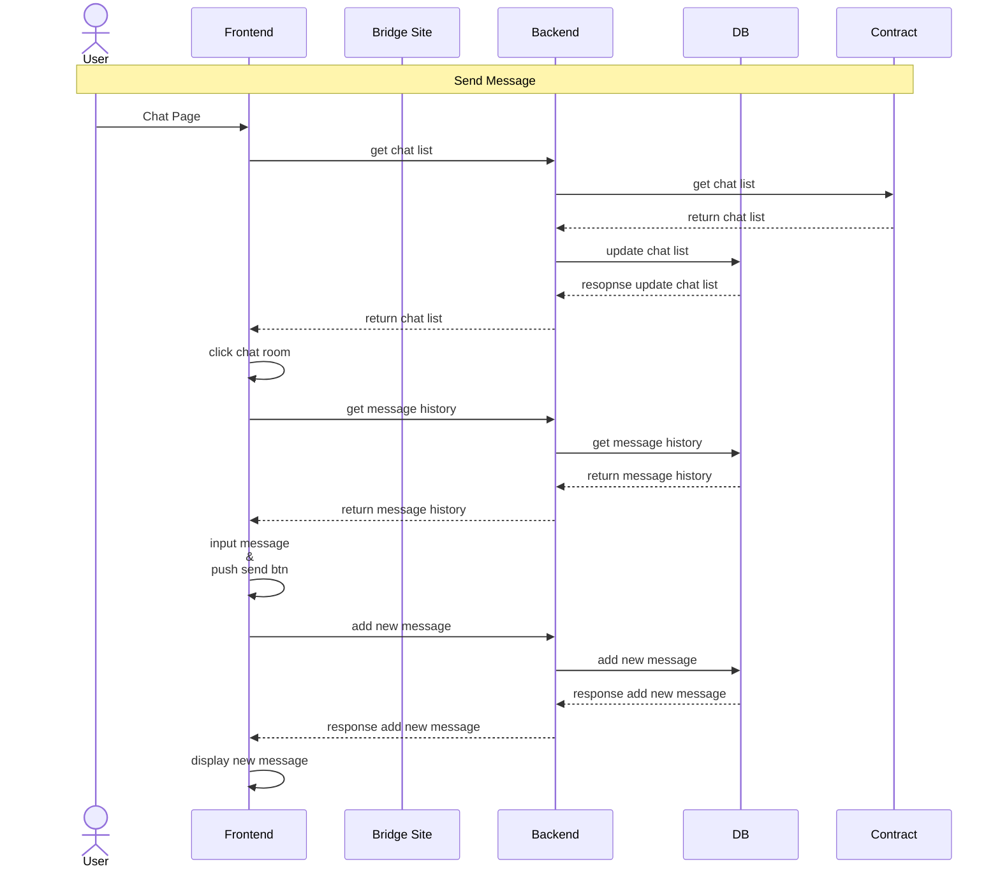

# Send Message

```mermaid
sequenceDiagram
    actor user as User
    participant front as Frontend
    participant bridge as Bridge Site
    participant back as Backend
    participant db as DB
    participant contract as Contract

    Note over user,contract: Send Message
    user->>front: Chat Page
    front->>back: get chat list
    back->>contract: get chat list
    contract-->>back: return chat list
    back->>db: update chat list
    db-->>back: resopnse update chat list
    back-->>front: return chat list
    front->>front: click chat room
    front->>back: get message history
    back->>db: get message history
    db-->>back: return message history
    back-->>front: return message history
    front->>front: input message<br />&<br />push send btn
    front->>back: add new message
    back->>db: add new message
    db-->>back: response add new message
    back-->>front: response add new message
    front->>front: display new message
```
