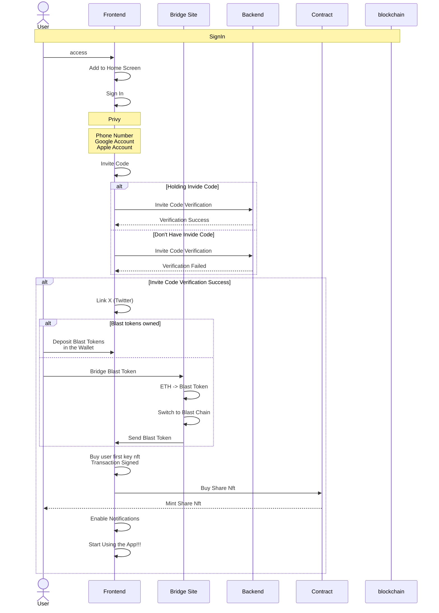

# Sign In

```mermaid
sequenceDiagram
    actor user as User
    participant front as Frontend
    participant bridge as Bridge Site
    participant back as Backend
    participant contract as Contract

    Note over user,blockchain: SignIn
    user->>front: access
    front->>front: Add to Home Screen
    front->>front: Sign In
    Note over front,front: Privy
    Note over front,front: Phone Number<br />Google Account<br />Apple Account
    front->>front: Invite Code
    alt Holding Invide Code
        front->>back: Invite Code Verification
        back-->>front: Verification Success
    else Don't Have Invide Code
        front->>back: Invite Code Verification
        back-->>front: Verification Failed
    end
    alt Invite Code Verification Success
        front->>front: Link X (Twitter)
        alt Blast tokens owned
            user->>front: Deposit Blast Tokens<br />in the Wallet
        else
            user->>bridge: Bridge Blast Token
            bridge->>bridge: ETH -> Blast Token
            bridge->>bridge: Switch to Blast Chain
            bridge->>front: Send Blast Token
        end
        front->>front: Buy user first key nft<br />Transaction Signed
        front->>contract: Buy Share Nft
        contract-->>user: Mint Share Nft
        front->>front: Enable Notifications
        front->>front: Start Using the App!!!
    end
```
